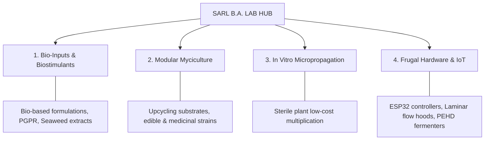

```
# SARL B.A. LAB — Integrated Agritech & Environmental Biotechnology Platform


## 📌 Executive Overview

**SARL B.A. LAB** is an agricultural biotechnology and environmental engineering startup based in Sétif, Algeria. Our mission is to deploy an integrated bio-economic platform to achieve input sovereignty, automate environmental control, and accelerate soil regeneration across arid and depleted ecosystems.

By merging applied microbiology (PGPR strains, ligninolytic fungi, bio-based biostimulants) with frugal industrial engineering (*Low-Tech High-Efficiency*) and IoT automation, B.A. LAB builds autonomous, modular, turnkey solutions designed for scale and climate resilience.

---

## 🏛️ System Architecture & Core Pillars

The platform is structured around four complementary technological pillars forming a closed-loop circular bio-economy:



### 1. Bio-Inputs & Biostimulants (Green Biotech)

* **Bio-based Formulations:** Development of enriched organic extracts, and activated biochar matrices.
* **Biocontrol & Microbiome:** Isolation and propagation of Plant Growth-Promoting Rhizobacteria (PGPR, *Bacillus spp.*) and biocontrol agents (*Trichoderma spp.*).

### 2. Modular Myciculture & Bioremediation (Circular Economy)

* **Fungal Production:** Optimized incubation and fruiting protocols for edible and medicinal species (*Pleurotus spp.*, *Hericium erinaceus*, *Agrocybe aegerita*, *Cordyceps militaris*).
* **Biomass Upcycling:** Processing local lignocellulosic agricultural waste into fertile substrates and soil amendments.

### 3. In Vitro Plant Micropropagation (TIS)

* **Temporary Immersion Systems:** Design and deployment of *Twin-Bottle* bioreactors and SIT modules for high-throughput multiplication of resilient elite plant varieties.
* **Media Autonomy:** Custom liquid and gelled culture media formulations to eliminate reliance on expensive imported laboratory reagents.

### 4. Frugal Engineering & IoT Systems (Digital & Hardware Innovation)

* **"Made in Algeria" Hardware:** In-house engineering of sterile laboratory equipment and substrate processing tools (HEPA laminar flow hoods, optimized straw shredders, horizontal PEHD biofermenters, modified mixers).
* **IoT Climate Regulation:** Microcontroller systems (ESP32 / Arduino) paired with sensor arrays (Temperature, Humidity, CO2) for real-time automation of bioclimatic greenhouses and incubation chambers.

---

## 📊 Key Impact Metrics & Sustainability

* **70%+ CAPEX Reduction:** Laboratory equipment and bioreactors manufactured locally at a fraction of imported hardware costs.
* **Water & Input Efficiency:** Closed-loop IoT irrigation and micropropagation systems drastically reducing water and fertilizer consumption.
* **Zero-Waste Bio-Economy:** Total valorization of raw organic agricultural waste into high-value biomass and soil conditioners.

---

## 🛠️ Repository Organization

This repository centralizes technical documentation, engineering schematics, Standard Operating Procedures (SOPs), and source code for the B.A. LAB ecosystem:

```text
SARL-BA-LAB/
├── 📂 01_R-and-D_Lab/                  # Plant Tissue Culture, Mycology & PGPR Fermentation
│   ├── 📂 micropropagation/            # TIS (Twin-Bottle/SIT) & In Vitro protocols
│   ├── 📂 myciculture/                 # Substrate formulations & fruiting parameters
│   └── 📂 biostimulants_PGPR/          # Fermentation protocols for PGPR & biocontrol
│
├── 📂 02_IoT_and_Automation/           # ESP32 C++ Firmware, PlatformIO & Digital Control Layer
│   ├── README.md                       # Digital layer documentation
│   ├── platformio.ini                  # PlatformIO configuration (ESP32)
│   └── 📂 firmware/                    # Arduino/C++ firmware code (SCD4x, relays)
│
├── 📂 03_Hardware_and_Machinery/       # HEPA H14 Hoods, Substrate Mixers & Shredders
│   ├── 📂 laminar_flow_hood/           # HEPA H14 hood schematics & calculations
│   ├── 📂 substrate_mixer/             # Modified mechanical substrate blender
│   └── 📂 straw_shredder/              # Particle sizing & sound dampening unit
│
└── 📂 04_Facility_and_Infrastructure/  # Multi-floor Layout, Zoning & Passive Water Harvesting
    ├── layout_plans.md                 # Multi-floor zoning & sanitary flows
    └── condensation_collectors.md      # Passive atmospheric water harvesting

```

---

## 🎯 Industrial Vision & Scalability

* **Technological Sovereignty:** Replacing costly imported lab gear and chemical inputs with locally engineered, calibrated, and maintained technology.
* **Soil Regeneration:** Restructuring degraded, saline, or arid soils through combined active microbiomes and stable humic matrices.
* **SOP Democratization:** Standardizing complex biotechnology procedures into robust, reproducible protocols for seamless field deployment and industrial execution.

---

## 📜 License & Intellectual Property

© 2026 **SARL B.A. LAB**. All rights reserved.

Hardware schematics and source code shared in this repository are subject to specific licenses detailed within each directory.

📧 **Contact & Support:** SARL B.A. LAB — Sétif, Algeria.

```

```
